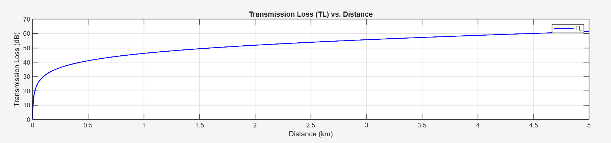
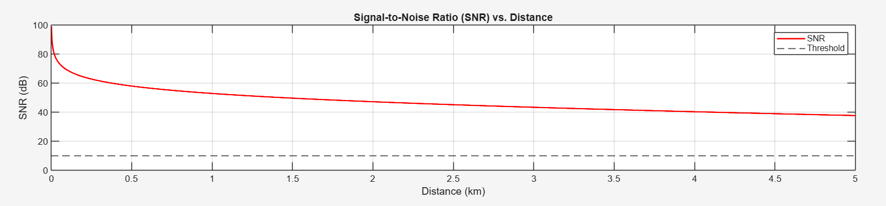

# Underwater Internet of Things in Smart Ocean: System Architecture & Open Issues

This repository contains the LaTeX source code, figures, and simulation files for the research paper titled "Underwater Internet of Things in Smart Ocean: System Architecture & Open Issues."

This paper was prepared as part of the coursework for CS_301/CS_361 at the Indian Institute of Information Technology (IIIT) Vadodara, Gandhinagar Campus.

## Abstract

This paper presents a foundational overview of the Internet of Underwater Things (UIoT) for realizing the Smart Ocean vision. It highlights the challenges of adapting terrestrial IoT models for marine environments and proposes a five-layer architecture to address issues in sensing, communication, networking, computation, and applications. Key obstacles such as unpredictable node movement, low-bandwidth underwater acoustic channels, and energy efficiency are analyzed, with an emphasis on artificial intelligence integration and fog/cloud computing. The work concludes by outlining open problems and future research directions.

## Authors

### Student Authors
* **Vinit Khandelwal** (`202351158@iiitvadara.ac.in`)
* **Kavyansh Khandelwal** (`202351063@iiitvadara.ac.in`)
* **Naman Singh** (`202351087@iiitvadara.ac.in`)
* **Deepanshu Verma** (`202351026@iiitvadara.ac.in`)
* **Mod Sameer** (`202351321@iiitvadara.ac.in`)

### Under the guidance of
* **Dr. Sunandita Debnath**
    * *Assistant Professor, Department of ECE*
    * *IIIT Vadodara, Gandhinagar Campus*

## Key Topics & Contributions

* **Five-Layer UIoT Architecture:** Proposes a robust five-layer model (Sensing, Communication, Networking, Fusion, Application) as a framework for future UIoT systems.
* **Channel Analysis:** Discusses the primary challenges of the underwater acoustic channel, including attenuation, ambient noise, and low bandwidth.
* **System Modeling:** Provides mathematical models for acoustic attenuation (Thorp's formula) and the four primary sources of ambient noise (shipping, waves, turbulence, thermal).
* **Simulation & Visualization:** Includes MATLAB code to simulate the underwater channel and generate plots for:
    1.  Transmission Loss (TL) vs. Distance
    2.  Signal-to-Noise Ratio (SNR) vs. Distance

## 📁 Repository Contents

This repository is organized into three main parts: the LaTeX paper source, the MATLAB physical layer simulation, and the Python network/fog layer simulation.

### 📄 Paper & LaTeX Source

This section contains the main files for the research paper itself.

* `main.tex`: The main LaTeX source file for the paper.
* `IEEEtran.cls`: The IEEE conference template file required to compile.
* `figure1.png`: Diagram of the proposed five-layer system architecture.
* `figure2.png`: Diagram breaking down UIoT theories, challenges, and open issues.

### 🌊 MATLAB Simulation (Physical Layer Model)

This simulation models the physical properties of the underwater acoustic channel to determine signal loss over distance.

* `CN_Group_35_Code_1.m`: The MATLAB script that models the physical UAC channel (as seen in the `lstlisting` section of the paper).
* **Results:**
    * `graph1.png`: Plot of Transmission Loss (TL) vs. Distance.
        
    * `graph2.png`: Plot of Signal-to-Noise Ratio (SNR) vs. Distance.
        

### 🐍 Python Simulation (Network/Fog Layer Model)

This simulation models the 5-layer architecture in action, demonstrating how a fog node can intelligently filter "Emergency" data from "Normal" data.

* `CN_Group_35_Code2.py`: The Python script that simulates the 5-layer architecture using `asyncio`.
* **Results:** (Showing one representative from each set)
    * `network_topology_round1.png`: The static network topology used in the simulation.
        
    * `sensor_data_plot_round1.png`: The "Cloud View" of sensor data, showing how the fog node successfully filtered out all high-priority "Emergency" data (values > 80).
        
